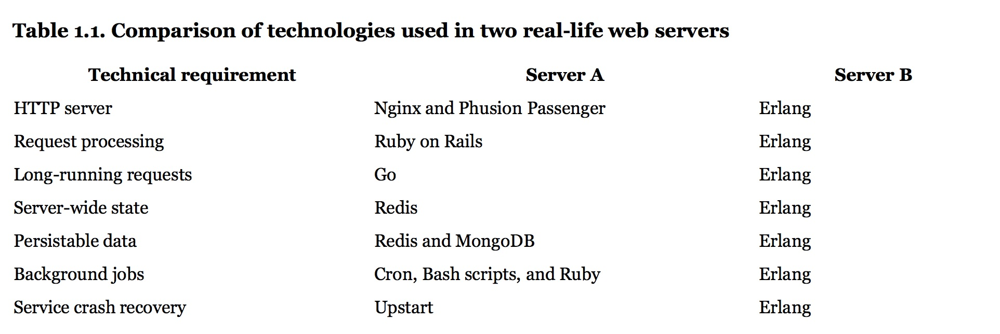

# Elixir in 20 Minutes

[Elixir](https://elixir-lang.org/) is a functional programming language built on top of [Erlang](http://www.erlang.org/).
Its focus is on building scalable and maintainable software on distributed and fault-tolerant systems.

#### Web Server Comparison
[](https://www.manning.com/books/elixir-in-action)

## History
- Erlang was created in 1986 by Ericsson to drive their telephone switches.
  - OTP, originally an acronym for Open Telecom Platform, is a collection of components that comprise the foundation of Erlang's resilience.
- Elixir was created by José Valim as an R&D project of Plataformatec.
  - José was a member of the Rails core team and wanted to build a friendly language like Ruby.
  - The goal was to build a more extensible and developer-friendly language while staying compatible with Erlang.
- Elixir compiles to bytecode for the BEAM (Erlang's virtual machine).
  - For simple programs, Elixir can be used as a scripting language.

### Syntax Comparison

#### Erlang
```erlang
-module(count_to_ten).
-export([count_to_ten/0]).

count_to_ten() -> do_count(0).

do_count(10) -> 10;
do_count(N) -> do_count(N + 1).
```

#### Elixir
```elixir
def CountToTen do
  def count_to_ten() do
    do_count(0)
  end

  defp do_count(10), do: 10
  defp do_count(n) do
    do_count(n + 1)
  end
end
```

## Types
- nil
- atom (symbol) `:atom`
  - alias `Atom == :"Elixir.Atom"`
- boolean `true == :true`
- integer `1000000 == 1_000_000`
- float `0.01 == 1.0e-2`
- string (binary) `"hi" == <<104, 105>>`
  - charlist `'hi' == [104, 105]`
  - sigil `"foo" =~ ~r/foo|bar/` `~r"foo|bar"i == sigil_r(<<"foo|bar">>, 'i')`
  - heredoc
  ```elixir
  """
  this is
  a heredoc string
  """
  ```
- tuple `{:ok, {:sent, "data"}}`
- list `[1, "b", :c, true]`
  - linked `[1 | [2 | [3 | []]]]`
  - io list `["Hello, ", [87, 111, 114, 108, 100]] == "Hello, World"`
- keyword list `[{:a, 1}, {:a, 0}, {:b, 2}] == [a: 1, a: 0, b: 2]`
  - accessing `kw_list[:a] == 1`
- map `%{"a" => 1, :b => 2, 3 => "c"}` `%{a: 1, b: 2}`
  - accessing `map[:a] == map.a`
- struct `%City{name: "Nashville"} == %{__struct__: City, name: "Nashville"}`
- function
  ```elixir
  def add(a, b) do
    a + b
  end
  ```
  - keyword list format
  ```elixir
  def add(a, b), do: a + b
  ```
  - anonymous
  ```elixir
  add = fn (a, b) -> a + b end
  add.(1, 2)
  ```
  - arity
  ```elixir
  def add(a, b), do: a + b          # add/2
  def add(a, b, c), do: a + b + c   # add/3
  ```
  - capturing
  ```elixir
  def add(a, b), do: a + b
  fun = &add/2
  ```
  - default arguments
  ```elixir
  def hello(name \\ "world") do
    "hello, " <> name
  end
  ```

Types can be checked with the `is_type` functions, such as `is_atom`, `is_binary`, `is_map`, etc.

## Operators
- arithmetic (`+`, `-`, `*`, `/`, `div`, `rem`)
  - `/` always produces a float result
  - `div` and `rem` are integer division and remainder operators
- list manipulation (`++`, `--`)
  ```elixir
  [1, 2, 3] ++ [4, 5, 6] == [1, 2, 3, 4, 5, 6]
  [1, 2, 3] -- [2] == [1, 3]
  ```
- string concatenation (`<>`)
  ```elixir
  "foo" <> "bar" == "foobar"
  ```
- strict boolean (`or`, `and`, `not`)
  - require boolean as first operand
- lax boolean (`||`, `&&`, `!`)
  - accepts any type
  - everything except false and nil are true
- comparison (`==`, `!=`, `===`, `!==`, `>=`, `<=`, `<`, `>`)
  ```elixir
  1 == 1.0   # true
  1 === 1.0  # false
  ```
  - data type ordering
    ```elixir
    number < atom < reference < function < port < pid < tuple < map < list < bitstring
    ```
- match (`=`)
  ```elixir
  a = "a"   # "a"
  "a" = a   # "a"
  "b" = a   # MatchError
  ```
- pin (`^`)
  ```elixir
  a = "a"   # "a"
  ^a = "b"  # MatchError
  ```
- pipe (`|>`)
  ```elixir
  String.replace(String.upcase("hello world"), " ", "_")

  "hello world"
  |> String.upcase
  |> String.replace(" ", "_")
  ```

## Code Organization

### Functions

Except for a small set of core functions that operate at the system level, such as `Calendar.date/0`,
all functions in Elixir transform input into output.

### Modules (alias, require, import, use) (attributes)

Modules serve as a mechanism to group related functions and provide a namespace.

At compile time, modules may be augmented by the `alias`, `require`, and `import` directives and the `use` macro.
- `alias` allows for creating more friendly names for modules.
Calling without the `:as` option uses the last part of the module name.
```elixir
alias Math.Coordinate, as: Coord
alias Math.Coordinate
```
- `require` allows using macros defined in a module.
```elixir
require Integer
Integer.is_odd(5)
```
- `import` provides access to fuctions or macros without using the full name.
```elixir
import Enum, only: [map: 2]
```
- `use` requires a module and invokes its `__using__/1` macro to inject code into the calling module.
```elixir
use Feature, option: :value
```

Multiple modules may be referenced by the same directive by using braces.
```elixir
alias MyApp.{Foo, Bar, Baz}
```

Module attributes, defined with `@` such as `@limit 10`, are commonly used to defined module scoped constants.

Defining a struct inside a module creates a tagged map that allows for
compile time guarantees, default values, and a common data element to build functions around.

### Applications

An application is a complete component providing a specific set of functionality that operates as a unit and
may be re-used in other systems.
Applications form the building blocks of a full Elixir system.

An example web server may include a set of distinct applications for its separate concerns:
- web api
- database access
- encapsulated library of business logic
- event sourcing handlers

## Pattern Matching

Pattern matching forms a fundamental part of control flow in elixir.

A function may be defined with multiple clauses.
When called, each clauses will be tested in the order defined until a match is found.
If no match is found, an error is raised.

```elixir
defmodule Math do
  def zero?(0), do: true
  def zero?(n) when is_integer(n), do: false
end

Math.zero?(0) == true
Math.zero?(1) == false
Math.zero?(0.5)  # FunctionClauseError
```

Pattern matching enables a programming style known as railway-oriented or happy-path programming.
Functions with a more likely possiblity of failure typically return `:ok`/`:error` tuples
such as `{:ok, data}` and `{:error, error}`.

This allows for functions to be piped together.
The successful operations continue being processed while any errors are rerouted to be handled gracefully.

A common practice is to use `with` to handle the branching paths.

```elixir
with {:ok, response} <- Api.fetch(@url),
     mapped_data = Enum.map(response, &format/1),
     {:ok, processed} <- Lib.process(mapped_data) do
  {:ok, processed}
else
  {:error, {:network_error, fetch_details}} ->
    {:error, format_error_details(details)},
  {:error, {:processing_error, processing_details}} ->
    {:error, processing_details},
  error ->
    {:error, error}
end
```

## Control Flow

While pattern matching is the most common method of control flow, other structures are used to varying degrees.

- `case` compares a value against patterns until a matching one is found.
```elixir
case {2, 1} do
  {0, 0} -> "At the origin"
  {0, y} -> "On the X axis at #{y}"
  {x, 0} -> "On the Y axis at #{x}"
  {_, _} -> "Not axis aligned"
  _ -> "Not a valid point"
end
```

- `cond` tests multiple conditions until one evaluates to true (any value besides `nil` and `false`).
```elixir
cond do
  2 + 2 == 5 ->
    "This is never true"
  2 * 2 == 3 ->
    "Nor this"
  true ->
    "This is always true (equivalent to else)"
end
```

- `if` and `unless` are commonly not needed but can be useful if checking for a single condition.
```elixir
if true do
  "Do the thing"
end
# returns nil
```

```elixir
unless true do
  "Unless matches if false"
else
  "So this is the result"
end
```

Insead of special constructs, `if` and `unless` are implemented as macros around `cond`.

## Recursion

Functional languages make use of recursion more commonly than object oriented languages due to immutability.
Common `for` loops rely on mutability in incrementing the counter.

Elixir is optimized for tail calls such that, if the last operation of a function is a call to itself,
a new stack frame is not allocated, making it a free operation. Languages without this optimization can lead
to stack overflows at large recursive tasks.

Pattern matching allows for simpler recurive functions by separating conditions into separate clauses.
```elixir
def print_repeated(msg, count) when count <= 1 do
  IO.puts msg
end

def print_repeated(msg, count) do
  IO.puts msg
  print_repeated(msg, count - 1)
end

print_repeated("echo", 4)   # prints "echo" 4 times
```

### Enumerable

Data structures in Elixir are enumerable if they implement the `Enumerable` protocol.

These data structures, including lists and maps, work with functions in the `Enum` module and its lazy
counterpart the `Stream` module.
These modules provide methods, such as `map`, `filter`, and `reduce`, for working with collections of data.

- Sum the double value of all even numbers from 1 to 100,000, iterating over the collection for each operation.
```elixir
1..100_000
|> Enum.filter(even?)
|> Enum.map(&(&1 * 2))
|> Enum.sum
```

- Using the lazy `Stream`, the collection is only iterated over once.
```elixir
1..100_000
|> Stream.filter(even?)
|> Stream.map(&(&1 * 2))
|> Enum.sum
```

### Comprehensions

Because it is common to iterate over enumerables to transform the collection, Elixir offers the comprehension
construct composed of generators, filters, and collectables.
- generators provide the collection to be used
- filters limit the operation to the values satisfying the filter
- collectables provide a mechanism to convert to a different data structure

```elixir
for {key, val} <- %{"a" => 1, "b" => 2}, into: %{}, do: {key, val * val}
%{"a" => 1, "b" => 4}

```
- `%{"a" => 1, "b" => 2}` uses the elements of a map as the generator
- `{key, val}` pattern matches to extract the elements and filters to only operate on tuples
- `into: %{}` uses a map as a collectable, mapping the tuples into the new map

## Protocols

Protocols are the primary method of polymorphism in Elixir.

Data types that implement a protocol define implementations of functions that are applicable across varied
types.  Implementations of a protocol may be defined at the data type definition or separately
(for built-in types, etc.).

```elixir
defprotocol Size do
  @doc "Calculates the size (not the length!) of a data structure"
  def size(data)
end

defimpl Size, for: BitString do
  def size(string), do: byte_size(string)
end

defimpl Size, for: Map do
  def size(map), do: map_size(map)
end

defimpl Size, for: Tuple do
  def size(tuple), do: tuple_size(tuple)
end

Size.size("hello") == 5
Size.size({:ok, "data"}) == 2
Size.size(%{a: 1}) == 1
Size.size([1, 2, 3])  # Protocol.UndefinedError
```

## Behaviours

Similar to interfaces in object oriented languages, behaviours define a public API that must be
implemented for a module to encapsulate varying sets of logic.

```elixir
defmodule Parser do
  @callback parse(String.t) :: {:ok, term} | {:error, String.t}
  @callback extensions() :: [String.t]

  def parse!(implementation, contents) do
    case implementation.parse(contents) do
      {:ok, data} -> data
      {:error, error} -> raise ArgumentError, "parsing error: #{error}"
    end
  end
end


defmodule JSONParser do
  @behaviour Parser

  def parse(str), do: # ... parse JSON
  def extensions, do: ["json"]
end

defmodule YAMLParser do
  @behaviour Parser

  def parse(str), do: # ... parse YAML
  def extensions, do: ["yml"]
end
```


## Error Handling

Elixir has three mechanisms for directly dealing with exeptional circumstances.

### errors (exceptions)

For exceptional circumstances, such as outcomes of opening a file, an error may be raised with `raise/1` or
`raise/2`. Errors may be rescued by using `try/rescue`, optionally pulling details out of the error.

Typically, `try/rescue` is rarely used in favor of `{:ok, result}` and `{:error, reason}` tuples to allow
graceful handling of these circumstances.

Many libraries provide pairs of functions that deal with more unpredictable operations. The `foo` form
returns `:ok/:error` tupeles, and the `foo!` form raises execptions. This separation allows the developer
to choose how to deal with the exceptional circumstances.

### throw

`throw` and `catch` are typically reserved for working with libraries that do not have a proper API and a
value can only be accessed in a `catch` after a `throw`.

### exit

Within Elixir's processes, an `exit` signal informs a process to die. This forms one of the foundational
aspects of the system's fault-tolerance.

### let it crash

Once all of the predictable error situations are accounted for in a developed system, the accepted strategy
is to "let it crash". Typically, these circumstances are caused by an unexpected state, and letting the process
crash allows a clean state to be restored. The strategies defined in the application's supervision tree are
implemented to account for these unpredictable occurances.

## Tooling

Elixir includes a robust set of tooling to aid in development.

### Mix

Akin to Node's NPM and Ruby's rake, Elixir comes with the general purpose build tool Mix.

`mix new <name>` is used to generate a fresh project.

Typically a project is defined in a `mix.exs` file, defining the varying options including dependencies,
tasks, and configuration paths.

With a defined project, mix tasks can be run from the command line:
- `mix compile` to compile the project
- `mix test` to run the test suite for the project
- `mix run` for specific commands in the project
- `mix help` lists available tasks including those defined in the mix file

### IEx

IEx is Elixir's interactive shell. It includes various helpers for various tasks and inspection. The list
of helpers can be accessed with `h()`.

Remote nodes may be connected to from the local session to interact with already running applications.

### ExUnit

ExUnit is the full test framework included with Elixir.

Tests are defined in script files, typically defined in the `test` directory named `<filename>_test.exs` for
each file in the `lib` directory.

Tests use `ExUnit.Case` to inject the API and define tests with the `test/2` macro. A `test/test_helper.exs`
file is responsible for setting up the test framework.

ExUnit allows for documentation to embed tests alongside the functions being documented.

```elixir
@doc """
Add 2 numbers together.

## Examples

  iex> add(1, 2)
  3

"""
def add(a, b) do
  a + b
end
```

### typespecs

Being a dynamically typed language, types are not enforced during compilation; however, Elixir has support for
typespecs, a notation for declaring data types and specifications for typed function signatures.

```elixir
@spec add(number, number) :: number
def add(a, b) do
  a + b
end
```

Typespecs server as an additional layer of documentation. Also, Dialyzer is an Erlang tool for static code
analysis to check code against the defined types and specs. The Dialyxir application provides an Elixir
focused wrapper for Dialyzer.

## processes
### lightweight (!= threads)
### mailboxes & messaging
### linking
### state via receive recursion
### tasks & agents

## OTP
### GenServer
### Supervisor
### supervision trees (let it crash)
### ETS
### Mnesia
### Applications
### Umbrella Applications

## Macros


## Resources
- [Elixir Docs](https://elixir-lang.org/getting-started/introduction.html)
- [hexdocs Elixir](https://hexdocs.pm/elixir/)
- [Learn Elixir in Y minutes](https://learnxinyminutes.com/docs/elixir/)
- [Programming Elixir](https://pragprog.com/book/elixir13/programming-elixir-1-3)
- [Elixir In Action](https://www.manning.com/books/elixir-in-action)
